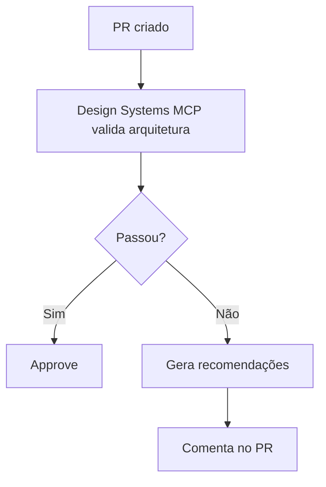
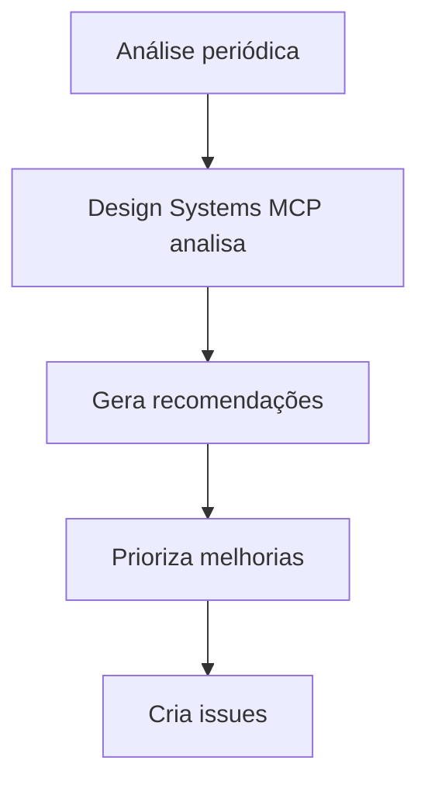

# Design Systems MCP Integration

Este documento descreve como usar o Design Systems MCP para acessar conhecimento especializado sobre design systems.

## Visão Geral

O Design Systems MCP fornece:
- Acesso a best practices de design systems
- Sugestões de padrões de composição
- Validação de arquitetura
- Recomendações de acessibilidade
- Conhecimento especializado da indústria

## Configuração

### 1. Configurar no Cursor

Edite `.cursor/mcp.json`:

```json
{
  "mcpServers": {
    "storybook": {
      "type": "http",
      "url": "http://localhost:6006/mcp"
    },
    "design-systems": {
      "url": "https://mcp.so/server/design-systems-mcp",
      "description": "AI-powered design systems knowledge base"
    }
  }
}
```

### 2. Verificar Conexão

Após configurar, reinicie o Cursor/Claude Code. O MCP estará disponível para AI agents.

## Casos de Uso

### 1. Validação de Arquitetura

**Pergunta para AI agent**:
"Use Design Systems MCP to validate if our component architecture follows best practices"

**O que o MCP pode fazer**:
- Analisar estrutura de categorias (atoms, molecules, organisms)
- Validar regras de importação
- Sugerir melhorias na organização
- Comparar com padrões da indústria

### 2. Sugestões de Padrões

**Pergunta para AI agent**:
"What composition patterns should we use for a complex form component?"

**O que o MCP pode fazer**:
- Sugerir padrões apropriados
- Fornecer exemplos de implementação
- Explicar trade-offs
- Recomendar alternativas

### 3. Validação de Acessibilidade

**Pergunta para AI agent**:
"Validate our accessibility implementation against design system best practices"

**O que o MCP pode fazer**:
- Verificar padrões de acessibilidade
- Sugerir melhorias
- Validar contra WCAG
- Recomendar ferramentas

### 4. Recomendações de API

**Pergunta para AI agent**:
"What's the best API design for a compound component?"

**O que o MCP pode fazer**:
- Sugerir APIs baseadas em best practices
- Fornecer exemplos de APIs similares
- Explicar decisões de design
- Recomendar padrões

## Integração com Scripts

### Validar Arquitetura

Criar `scripts/mcp-validate-architecture.ts`:

```typescript
#!/usr/bin/env tsx
/**
 * Validate Architecture using Design Systems MCP
 * 
 * Uses Design Systems MCP to validate component architecture
 */

// This would:
// 1. Analyze current architecture
// 2. Query Design Systems MCP for best practices
// 3. Compare and generate recommendations
// 4. Create validation report
```

### Gerar Recomendações

Criar `scripts/mcp-generate-recommendations.ts`:

```typescript
#!/usr/bin/env tsx
/**
 * Generate Recommendations using Design Systems MCP
 * 
 * Gets recommendations for improving the design system
 */

// This would:
// 1. Analyze current state
// 2. Query Design Systems MCP
// 3. Generate actionable recommendations
// 4. Create report with priorities
```

## Workflows

### Workflow: Validação Contínua



### Workflow: Melhoria Contínua



## Exemplos de Uso

### Exemplo 1: Validar Nova Categoria

```typescript
// Pergunta para AI agent:
"Should we create a new 'utilities' category for helper components?"

// Design Systems MCP pode responder:
// - Analisar se faz sentido
// - Comparar com outros design systems
// - Sugerir alternativas
// - Validar contra best practices
```

### Exemplo 2: Sugerir Padrão de Composição

```typescript
// Pergunta para AI agent:
"What's the best pattern for a data table with filtering and sorting?"

// Design Systems MCP pode:
// - Sugerir compound component pattern
// - Fornecer exemplos de implementação
// - Explicar trade-offs
// - Recomendar alternativas
```

### Exemplo 3: Validar Acessibilidade

```typescript
// Pergunta para AI agent:
"Are our accessibility patterns following industry best practices?"

// Design Systems MCP pode:
// - Validar padrões atuais
// - Sugerir melhorias
// - Comparar com outros design systems
// - Recomendar ferramentas
```

## Best Practices

### 1. Use para Validação

Use Design Systems MCP para validar decisões importantes:
- Nova arquitetura
- Novos padrões
- Mudanças significativas

### 2. Consulte Regularmente

Faça análises periódicas:
- Mensal: Revisão geral
- Por PR: Validação de mudanças
- Por release: Validação completa

### 3. Documente Recomendações

Quando receber recomendações:
- Documente decisões
- Explique por que seguiu ou não seguiu
- Mantenha histórico

### 4. Combine com Outros MCPs

Use em conjunto com:
- Storybook MCP: Para validação de componentes
- Figma MCP: Para validação de design
- MCP Extractor: Para análise de metadata

## Limitações

### 1. Conhecimento Geral

O MCP fornece conhecimento geral, não específico do seu projeto.

### 2. Requer Contexto

Forneça contexto suficiente para obter recomendações úteis.

### 3. Não Substitui Expertise

Use como ferramenta de apoio, não como única fonte de verdade.

## Próximos Passos

1. **Criar Scripts de Validação**: Automatizar validações
2. **Integrar com CI/CD**: Validação automática em PRs
3. **Dashboard de Recomendações**: Visualizar recomendações
4. **Histórico de Validações**: Rastrear melhorias ao longo do tempo

## Recursos

- [Design Systems MCP](https://mcp.so/server/design-systems-mcp)
- [MCP Documentation](https://modelcontextprotocol.io/)
