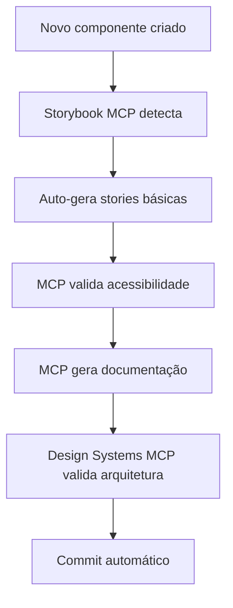
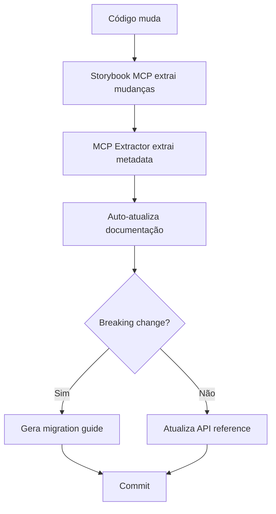
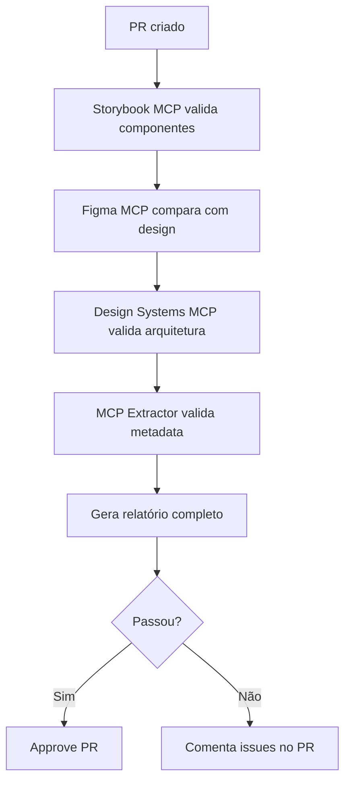
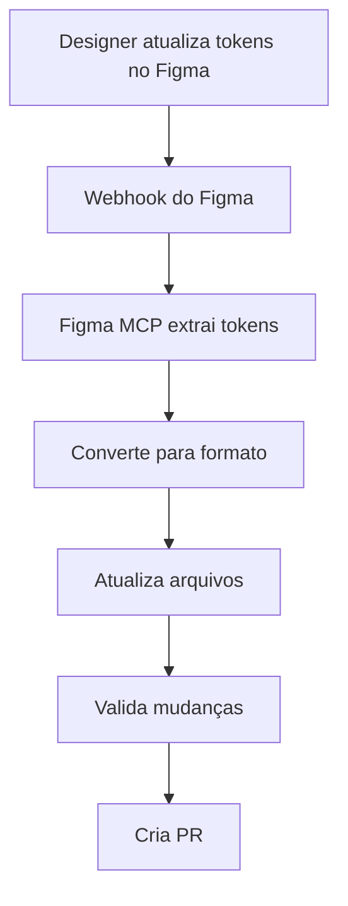

# Automações MCP

Este documento descreve todas as automações disponíveis usando MCPs (Model Context Protocol).

## Visão Geral

As automações MCP permitem:
- Geração automática de documentação
- Validação automática de componentes
- Sincronização automática design-code
- Extração automática de metadata
- Análise e recomendações automáticas

## Automações Disponíveis

### 1. Geração Automática de Documentação

**Script**: `npm run mcp:generate-docs`

**O que faz**:
- Usa Storybook MCP para listar todos os componentes
- Extrai informações de cada componente
- Gera documentação MDX automaticamente
- Atualiza API reference
- Cria exemplos de uso

**Output**:
- `docs/generated/*.md` - Documentação de cada componente

**Quando usar**:
- Após adicionar novos componentes
- Após mudanças significativas
- Antes de releases
- Para manter documentação atualizada

### 2. Health Check do MCP

**Script**: `npm run mcp:health-check`

**O que faz**:
- Verifica se Storybook MCP server está disponível
- Lista ferramentas disponíveis
- Valida conexão

**Output**:
- Status da conexão
- Lista de ferramentas disponíveis

**Quando usar**:
- Antes de usar outras automações MCP
- Para debug de problemas de conexão
- Para validar setup

### 3. Sync de Tokens do Figma

**Script**: `npm run mcp:figma-sync-tokens`

**O que faz**:
- Conecta ao Figma via MCP
- Extrai variáveis de design tokens
- Converte para formato de tokens do design system
- Atualiza arquivos de tokens
- Valida mudanças

**Requisitos**:
- `FIGMA_ACCESS_TOKEN` environment variable
- `FIGMA_FILE_KEY` environment variable
- Figma MCP server configurado

**Output**:
- `docs/figma-sync-report.json` - Relatório de sync

**Quando usar**:
- Após mudanças em tokens no Figma
- Para manter tokens sincronizados
- Antes de releases

### 4. Validação de Arquitetura

**Script**: `npm run mcp:validate-architecture`

**O que faz**:
- Analisa estrutura de componentes
- Valida contra best practices (via Design Systems MCP)
- Detecta violações de regras
- Gera recomendações

**Output**:
- `docs/architecture-validation-report.md` - Relatório de validação

**Quando usar**:
- Após mudanças na arquitetura
- Antes de adicionar novas categorias
- Para validar PRs
- Análise periódica

### 5. Extração de Metadata

**Script**: `npm run mcp:extract-metadata`

**O que faz**:
- Extrai HTML renderizado de componentes
- Extrai estilos CSS aplicados
- Extrai props e tipos
- Extrai dependências
- Extrai design tokens usados

**Requisitos**:
- Storybook rodando
- MCP Design System Extractor configurado

**Output**:
- `docs/extracted-metadata/metadata.json` - Metadata em JSON
- `docs/extracted-metadata/metadata-report.md` - Relatório

**Quando usar**:
- Para gerar registry completo
- Para validar consistência
- Para detectar breaking changes
- Para análise de uso de tokens

## Workflows Automatizados

### Workflow 1: Component Creation



**Implementação**:
- GitHub Action que monitora mudanças
- Usa MCPs para gerar código
- Cria PR com tudo pronto

### Workflow 2: Documentation Update



**Implementação**:
- Pre-commit hook ou GitHub Action
- Detecta mudanças em componentes
- Atualiza documentação automaticamente

### Workflow 3: Quality Assurance



**Implementação**:
- GitHub Action em PRs
- Executa todas as validações
- Gera relatório e comenta no PR

### Workflow 4: Token Sync



**Implementação**:
- Webhook do Figma
- GitHub Action que processa webhook
- Cria PR com tokens atualizados

## Scripts de Automação

### Scripts Criados

1. **mcp-health-check.ts** - Validação de conexão MCP
2. **mcp-generate-docs.ts** - Geração de documentação
3. **mcp-figma-sync-tokens.ts** - Sync de tokens do Figma
4. **mcp-validate-architecture.ts** - Validação de arquitetura
5. **mcp-extract-metadata.ts** - Extração de metadata

### Scripts Adicionais Recomendados

1. **mcp-sync-all.ts** - Sincroniza tudo (Figma, tokens, docs)
2. **mcp-validate-all.ts** - Validação completa usando todos os MCPs
3. **mcp-generate-migration.ts** - Gera migration guide automaticamente
4. **mcp-compare-versions.ts** - Compara versões e detecta mudanças

## Integração com CI/CD

### GitHub Actions Workflow

Criar `.github/workflows/mcp-automations.yml`:

```yaml
name: MCP Automations

on:
  pull_request:
    paths:
      - 'src/**/*.tsx'
      - 'src/**/*.ts'
  push:
    branches: [main]

jobs:
  validate:
    runs-on: ubuntu-latest
    steps:
      - uses: actions/checkout@v4
      - uses: actions/setup-node@v4
      - run: npm ci
      - run: npm run storybook &
      - run: sleep 10
      - run: npm run mcp:health-check
      - run: npm run mcp:validate-architecture
      - run: npm run mcp:extract-metadata
```

## Configuração Completa de MCPs

### .cursor/mcp.json (Completo)

```json
{
  "mcpServers": {
    "storybook": {
      "type": "http",
      "url": "http://localhost:6006/mcp",
      "description": "Storybook MCP server"
    },
    "figma": {
      "command": "npx",
      "args": ["-y", "@figma/mcp-server"],
      "env": {
        "FIGMA_ACCESS_TOKEN": "${FIGMA_ACCESS_TOKEN}",
        "FIGMA_FILE_KEY": "${FIGMA_FILE_KEY}"
      },
      "description": "Figma MCP server"
    },
    "design-systems": {
      "url": "https://mcp.so/server/design-systems-mcp",
      "description": "Design Systems MCP"
    },
    "design-system-extractor": {
      "command": "npx",
      "args": ["-y", "@freema/mcp-design-system-extractor"],
      "env": {
        "STORYBOOK_URL": "http://localhost:6006"
      },
      "description": "MCP Design System Extractor"
    }
  }
}
```

## Métricas de Sucesso

### Automação

- ✅ 70%+ de redução em tarefas manuais
- ✅ Documentação 100% auto-gerada
- ✅ Validação automática em cada PR
- ✅ Sync automático design-code

### Qualidade

- ✅ 100% de componentes com documentação
- ✅ 100% de validação automática
- ✅ 0 breaking changes não detectados
- ✅ Metadata sempre atualizada

## Troubleshooting

### Automação não executa

**Problema**: Scripts MCP não funcionam

**Soluções**:
1. Verifique se Storybook está rodando
2. Execute `npm run mcp:health-check`
3. Verifique configuração em `.cursor/mcp.json`
4. Verifique logs de erro

### Sync falha

**Problema**: Sync do Figma não funciona

**Soluções**:
1. Verifique tokens de acesso
2. Verifique file key
3. Verifique permissões
4. Verifique logs do MCP

### Validação falha

**Problema**: Validações sempre falham

**Soluções**:
1. Revise regras de validação
2. Verifique se são falsos positivos
3. Ajuste thresholds se necessário
4. Documente exceções

## Próximos Passos

1. **Expandir Automações**: Mais workflows automatizados
2. **Dashboard**: Visualizar status de automações
3. **Notificações**: Alertas quando automações falham
4. **Analytics**: Métricas de uso de automações

## Recursos

- [MCP_STRATEGY.md](./MCP_STRATEGY.md) - Estratégia completa
- [MCP_SETUP.md](./MCP_SETUP.md) - Setup detalhado
- [FIGMA_MCP_INTEGRATION.md](./FIGMA_MCP_INTEGRATION.md) - Figma MCP
- [DESIGN_SYSTEMS_MCP.md](./DESIGN_SYSTEMS_MCP.md) - Design Systems MCP
- [MCP_EXTRACTOR.md](./MCP_EXTRACTOR.md) - MCP Extractor
