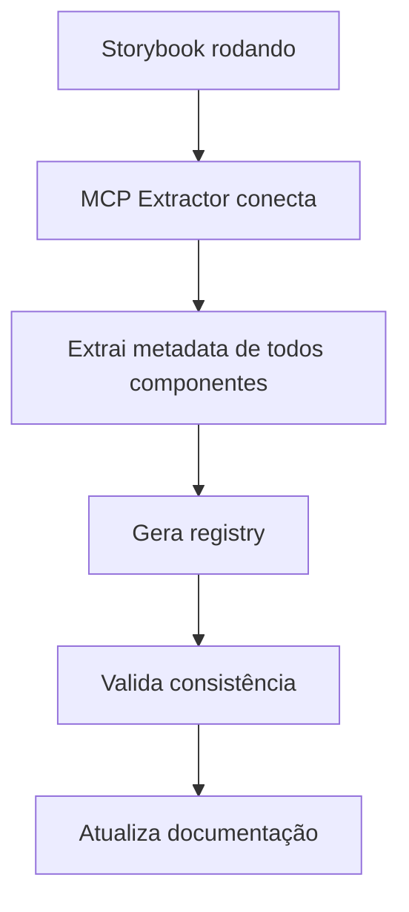
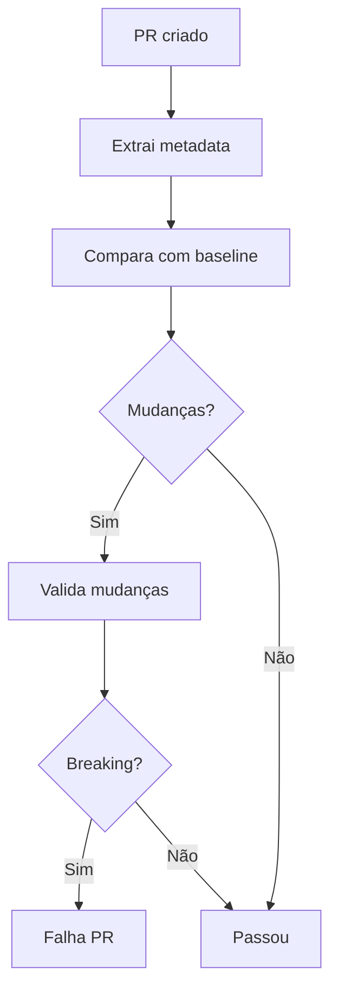

# MCP Design System Extractor

Este documento descreve como usar o MCP Design System Extractor para extrair metadata automática de componentes do Storybook.

## Visão Geral

O MCP Design System Extractor permite:
- Extrair HTML renderizado de componentes
- Extrair estilos CSS aplicados
- Extrair props e tipos TypeScript
- Extrair dependências (imports)
- Gerar registry completo com metadata
- Validar consistência

## Configuração

### 1. Instalar MCP Design System Extractor

O extractor pode ser usado via npx ou instalado.

### 2. Configurar no Cursor

Edite `.cursor/mcp.json`:

```json
{
  "mcpServers": {
    "storybook": {
      "type": "http",
      "url": "http://localhost:6006/mcp"
    },
    "design-system-extractor": {
      "command": "npx",
      "args": ["-y", "@freema/mcp-design-system-extractor"],
      "env": {
        "STORYBOOK_URL": "http://localhost:6006"
      },
      "description": "Extract metadata from Storybook components"
    }
  }
}
```

### 3. Verificar Conexão

O extractor precisa que o Storybook esteja rodando para funcionar.

## Uso

### Extrair Metadata de um Componente

```typescript
// Via MCP, você pode extrair:
// - HTML renderizado
// - CSS/styles aplicados
// - Props e tipos
// - Dependencies
// - Design tokens usados
```

### Pipeline de Extração

Criar `scripts/mcp-extract-metadata.ts`:

```typescript
#!/usr/bin/env tsx
/**
 * Extract Component Metadata using MCP Extractor
 * 
 * Extracts comprehensive metadata from all components in Storybook
 */

// Este script:
// 1. Lista todos os componentes no Storybook
// 2. Para cada componente, extrai:
//    - HTML renderizado
//    - CSS/styles
//    - Props
//    - Dependencies
//    - Design tokens
// 3. Gera registry completo
// 4. Valida consistência
```

## Metadata Extraída

### 1. HTML Renderizado

HTML final renderizado do componente, útil para:
- Análise de estrutura
- Validação de markup
- Geração de documentação

### 2. CSS/Styles

Estilos aplicados ao componente:
- Classes CSS
- Estilos inline
- Design tokens usados
- Media queries

### 3. Props e Tipos

Props do componente:
- Nome e tipo
- Valores padrão
- Required/optional
- Descrições

### 4. Dependencies

Dependências do componente:
- Imports de outros componentes
- Imports de hooks
- Imports de utilities
- Imports externos

### 5. Design Tokens

Tokens de design usados:
- Cores
- Espaçamento
- Tipografia
- Shadows
- etc.

## Casos de Uso

### 1. Gerar Registry Automático

```bash
npm run mcp:extract-metadata
```

Gera registry completo com toda a metadata extraída.

### 2. Validar Consistência

Valida:
- Props documentados vs reais
- Design tokens usados vs disponíveis
- Dependencies vs arquitetura
- Estilos vs design system

### 3. Detectar Breaking Changes

Compara versões e detecta:
- Props removidos
- Props modificados
- Dependencies mudadas
- Estilos alterados

### 4. Gerar Documentação

Usa metadata para gerar:
- API reference
- Exemplos de uso
- Migration guides
- Design token usage

## Scripts de Automação

### Extract All Metadata

```typescript
// scripts/mcp-extract-metadata.ts
// Extrai metadata de todos os componentes
```

### Validate Consistency

```typescript
// scripts/mcp-validate-metadata.ts
// Valida consistência da metadata
```

### Generate Registry

```typescript
// scripts/mcp-generate-registry.ts
// Gera registry baseado em metadata extraída
```

## Integração com Outros Scripts

### Combinar com Component Registry

O extractor pode melhorar o `generate-component-registry.ts`:
- Metadata mais precisa
- Informações de runtime
- Estilos reais aplicados

### Combinar com Token Migration

Pode detectar uso de tokens:
- Quais tokens são usados
- Onde são usados
- Se há tokens deprecated

## Workflows

### Workflow: Extração Periódica



### Workflow: Validação Contínua



## Best Practices

### 1. Extrair Regularmente

Execute extração:
- Após cada release
- Antes de releases major
- Quando houver mudanças significativas

### 2. Validar Consistência

Sempre valide após extração:
- Props vs documentação
- Tokens vs disponíveis
- Dependencies vs regras

### 3. Usar para Detecção

Use para detectar:
- Breaking changes
- Inconsistências
- Oportunidades de melhoria

### 4. Combinar com Outros MCPs

Combine com:
- Storybook MCP: Para informações de stories
- Design Systems MCP: Para validação
- Figma MCP: Para comparação

## Troubleshooting

### Extractor não conecta

**Problema**: Não consegue conectar ao Storybook

**Soluções**:
1. Verifique se Storybook está rodando
2. Verifique STORYBOOK_URL no config
3. Verifique permissões
4. Tente reiniciar Storybook

### Metadata incompleta

**Problema**: Algumas informações não são extraídas

**Soluções**:
1. Verifique se componente está renderizado
2. Verifique se stories existem
3. Verifique logs do extractor
4. Tente componente por componente

## Próximos Passos

1. **Automação Completa**: Pipeline de extração automática
2. **Comparação de Versões**: Detectar mudanças
3. **Validação Automática**: CI/CD integration
4. **Dashboard**: Visualizar metadata

## Recursos

- [MCP Design System Extractor](https://mcpservers.org/servers/freema/mcp-design-system-extractor)
- [MCP Documentation](https://modelcontextprotocol.io/)
