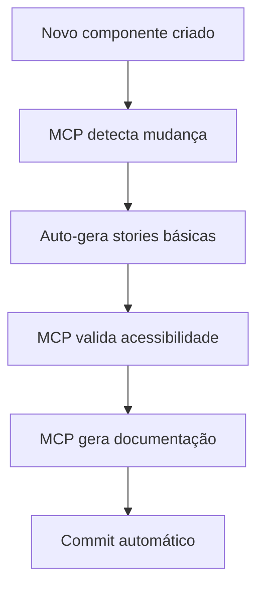
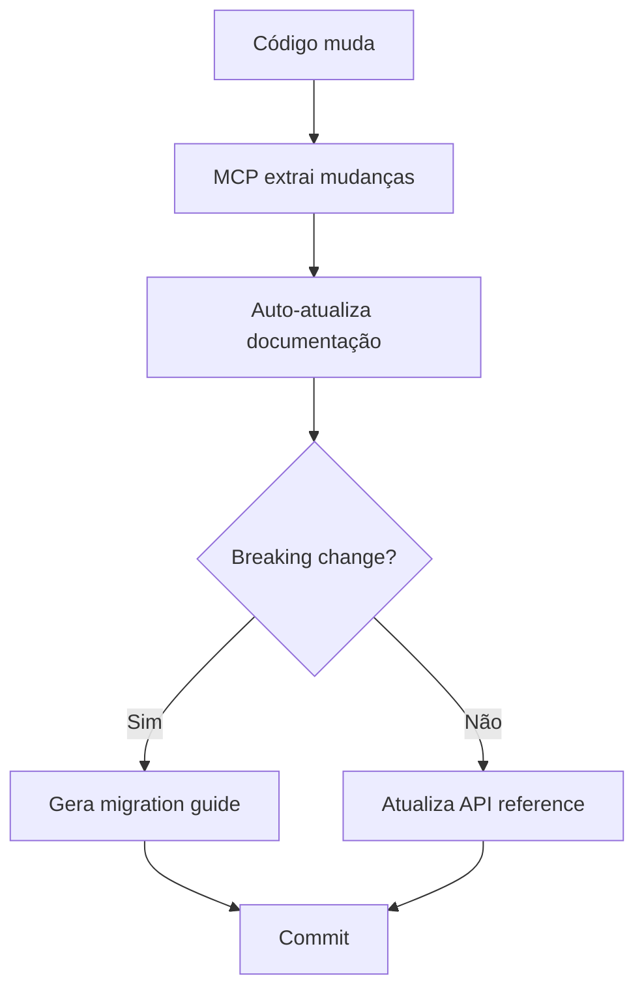
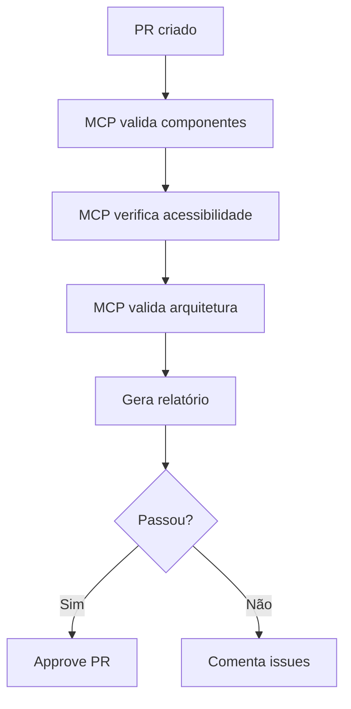

# Estratégia MCP - Model Context Protocol

Este documento descreve a estratégia completa de uso de MCPs (Model Context Protocol) no React Design System.

## Visão Geral

MCPs permitem que AI agents interajam diretamente com o Storybook e outras ferramentas, habilitando automação inteligente de documentação, validação e geração de código.

## Storybook MCP Addon

### Status

✅ **Instalado e Configurado**
- Versão: `@storybook/addon-mcp@^0.1.8`
- Endpoint: `http://localhost:6006/mcp` (quando Storybook está rodando)

### Configuração

O addon já está configurado em `.storybook/main.ts`. Para usar:

1. **Iniciar Storybook**:
   ```bash
   npm run storybook
   ```

2. **MCP Server disponível em**: `http://localhost:6006/mcp`

### API Endpoints Disponíveis

#### 1. list-all-components

Lista todos os componentes e stories disponíveis.

**Request**:
```json
{
  "jsonrpc": "2.0",
  "id": 1,
  "method": "tools/call",
  "params": {
    "name": "list-all-components",
    "arguments": {}
  }
}
```

**Response**:
```json
{
  "jsonrpc": "2.0",
  "id": 1,
  "result": {
    "components": [
      {
        "name": "Button",
        "category": "Atoms",
        "stories": ["Primary", "Secondary", "Disabled"],
        "path": "src/ui/atoms/Button"
      }
    ]
  }
}
```

#### 2. get-component-info

Obtém metadata detalhada de um componente específico.

**Request**:
```json
{
  "jsonrpc": "2.0",
  "id": 2,
  "method": "tools/call",
  "params": {
    "name": "get-component-info",
    "arguments": {
      "componentName": "Button"
    }
  }
}
```

**Response**:
```json
{
  "jsonrpc": "2.0",
  "id": 2,
  "result": {
    "name": "Button",
    "category": "Atoms",
    "props": [...],
    "stories": [...],
    "dependencies": [...]
  }
}
```

#### 3. capture-screenshot

Captura screenshot de uma story específica.

**Request**:
```json
{
  "jsonrpc": "2.0",
  "id": 3,
  "method": "tools/call",
  "params": {
    "name": "capture-screenshot",
    "arguments": {
      "storyId": "atoms-button--primary",
      "viewport": "desktop"
    }
  }
}
```

#### 4. get-story-info

Obtém informações detalhadas de uma story.

**Request**:
```json
{
  "jsonrpc": "2.0",
  "id": 4,
  "method": "tools/call",
  "params": {
    "name": "get-story-info",
    "arguments": {
      "storyId": "atoms-button--primary"
    }
  }
}
```

### Integração com Cursor/Claude Code

Para conectar AI agents ao Storybook MCP:

1. **Criar/Editar `.cursor/mcp.json`**:
```json
{
  "mcpServers": {
    "storybook": {
      "type": "http",
      "url": "http://localhost:6006/mcp",
      "description": "Storybook MCP server for component information"
    }
  }
}
```

2. **Iniciar Storybook**:
```bash
npm run storybook
```

3. **AI agents agora podem**:
   - Listar componentes
   - Obter informações de componentes
   - Capturar screenshots
   - Gerar documentação baseada em componentes reais

## Scripts de Automação

### 1. Health Check Script

Criar `scripts/mcp-health-check.ts`:

```typescript
#!/usr/bin/env tsx
/**
 * MCP Health Check
 * Verifica se o Storybook MCP server está disponível
 */

const MCP_URL = 'http://localhost:6006/mcp';

async function healthCheck() {
  try {
    const response = await fetch(MCP_URL, {
      method: 'POST',
      headers: { 'Content-Type': 'application/json' },
      body: JSON.stringify({
        jsonrpc: '2.0',
        id: 1,
        method: 'tools/list',
        params: {},
      }),
    });

    if (response.ok) {
      const data = await response.json();
      console.log('✅ MCP Server is available');
      console.log(`Available tools: ${data.result?.tools?.length || 0}`);
      return true;
    } else {
      console.error('❌ MCP Server returned error:', response.status);
      return false;
    }
  } catch (error) {
    console.error('❌ MCP Server is not available:', error.message);
    console.log('💡 Make sure Storybook is running: npm run storybook');
    return false;
  }
}

healthCheck().then((success) => {
  process.exit(success ? 0 : 1);
});
```

### 2. Generate Docs Script

Criar `scripts/mcp-generate-docs.ts`:

```typescript
#!/usr/bin/env tsx
/**
 * Generate Documentation using MCP
 * Usa Storybook MCP para extrair informações e gerar documentação
 */

const MCP_URL = 'http://localhost:6006/mcp';

async function callMCP(method: string, params: any) {
  const response = await fetch(MCP_URL, {
    method: 'POST',
    headers: { 'Content-Type': 'application/json' },
    body: JSON.stringify({
      jsonrpc: '2.0',
      id: Date.now(),
      method,
      params,
    }),
  });

  if (!response.ok) {
    throw new Error(`MCP call failed: ${response.status}`);
  }

  const data = await response.json();
  if (data.error) {
    throw new Error(`MCP error: ${data.error.message}`);
  }

  return data.result;
}

async function generateDocs() {
  console.log('📚 Generating documentation using MCP...\n');

  try {
    // List all components
    const components = await callMCP('tools/call', {
      name: 'list-all-components',
      arguments: {},
    });

    console.log(`Found ${components.components?.length || 0} components\n`);

    // Generate docs for each component
    for (const component of components.components || []) {
      console.log(`📝 Processing ${component.name}...`);

      const info = await callMCP('tools/call', {
        name: 'get-component-info',
        arguments: { componentName: component.name },
      });

      // Generate MDX documentation
      // ... implementation
    }

    console.log('\n✅ Documentation generated successfully');
  } catch (error) {
    console.error('❌ Error generating documentation:', error);
    process.exit(1);
  }
}

generateDocs();
```

## Workflows de Automação

### Workflow 1: Component Creation



### Workflow 2: Documentation Update



### Workflow 3: Quality Assurance



## Próximos MCPs a Configurar

### 1. Figma MCP Server

**Objetivo**: Sync automático design-code

**Configuração**:
```json
{
  "mcpServers": {
    "figma": {
      "command": "npx",
      "args": ["-y", "@figma/mcp-server"],
      "env": {
        "FIGMA_ACCESS_TOKEN": "${FIGMA_ACCESS_TOKEN}"
      }
    }
  }
}
```

**Uso**:
- Sync design tokens
- Gerar componentes do Figma
- Comparar design vs código

### 2. Design Systems MCP

**Objetivo**: Acesso a best practices

**Configuração**:
```json
{
  "mcpServers": {
    "design-systems": {
      "url": "https://mcp.so/server/design-systems-mcp"
    }
  }
}
```

**Uso**:
- Validação de arquitetura
- Sugestões de melhorias
- Best practices

### 3. MCP Design System Extractor

**Objetivo**: Extração automática de metadata

**Configuração**:
```json
{
  "mcpServers": {
    "design-system-extractor": {
      "command": "npx",
      "args": ["-y", "@freema/mcp-design-system-extractor"],
      "env": {
        "STORYBOOK_URL": "http://localhost:6006"
      }
    }
  }
}
```

**Uso**:
- Extrair metadata de componentes
- Gerar registry automático
- Validar consistência

## Métricas de Sucesso

- ✅ 100% de componentes acessíveis via MCP
- ✅ Automação de 70%+ das tarefas manuais
- ✅ Documentação 100% auto-gerada
- ✅ Validação automática em cada PR

## Recursos

- [Storybook MCP Addon](https://www.npmjs.com/package/@storybook/addon-mcp)
- [MCP Documentation](https://modelcontextprotocol.io/)
- [Storybook MCP GitHub](https://github.com/storybookjs/mcp)
